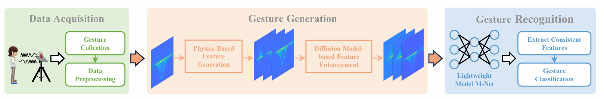
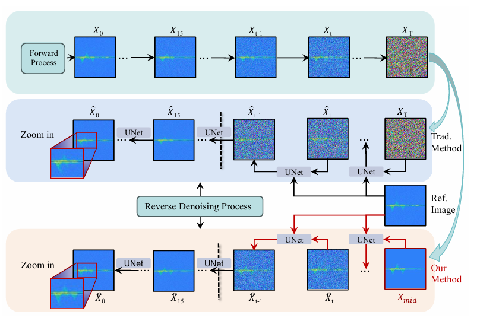

# mmGR-LO

Official implementation of **mmGR-LO: Advancing Location and
Orientation-Independent Sensing for Gesture Recognition Using mmWave**.

mmGR-LO generates gesture features for new user locations and orientations,
enhances them with a controlled diffusion model, and performs gesture
recognition with the lightweight M-Net.



<p align="center"><em>Overview of data acquisition, two-stage gesture generation, and gesture recognition in mmGR-LO.</em></p>

## What's Included

| Component | Location | Purpose |
| --- | --- | --- |
| Physics-based feature generation | `physics_generation/` | Implements the physical model and generates target-configuration DTMs |
| Controlled diffusion enhancement | `scripts/` | Enhances physics-generated features using the trained diffusion model |
| Trained checkpoint | `checkpoints/` | Contains `ema_0.9999_028000.pt` for inference |
| Reference features | `ref_imgs/` | Provides reference images and packaged `mid_*.jpg` start images |
| Verification | `tests/` | Tests the physical equations and DTM transformation behavior |

## Repository Layout

```text
mmGR-LO/
  assets/                         # Figures used in this README
  physics_generation/
    __init__.py
    physics.py                    # Eqs. (6)-(9) and DTM transformation
    cli.py                        # Command-line interface
  tests/
    test_physics_generation.py
  checkpoints/
    ema_0.9999_028000.pt
  ref_imgs/
    pushtarget40/
    ...
    mid_push_1.5m_40_01_Raw_0.bin.jpg
    ...
  scripts/
    mmgr_sample.py
    resizer.py
    guided_diffusion/
  README.md
  LICENSE
  requirements.txt
```

## Installation

Python 3.8 or later is recommended.

```bash
pip install -r requirements.txt
```

## Reproducing Gesture Generation

Gesture generation has two stages. The first stage applies the paper's
physics-based transformation to a reference DTM. The second stage uses the
controlled diffusion model to reduce the gap between the transformed feature
and a real gesture feature.

### Stage 1: Physics-Based Feature Generation

The implementation in `physics_generation/physics.py` corresponds to Section
IV-C.1 and Eqs. (6)-(9) of the paper. It operates on numerical Doppler-time
maps rather than plot colors or manually selected contours.

#### Paper-to-Code Map

| Paper method | Implementation |
| --- | --- |
| Recover motion speed and `cos(theta_i)` with Eq. (8) | `estimate_motion_geometry` |
| Recover signed reference angles | `estimate_reference_angles` |
| Construct `T_i = cos(theta_i + theta_n) / cos(theta_i)` with Eq. (9) | `transformation_vector` |
| Apply `F'_d = F_d x T` to the DTM Doppler axis | `warp_doppler_time_map` |
| Run the complete process from the command line | `python -m physics_generation.cli` |

#### Required Inputs

The module accepts a numerical DTM (`.npy`) or a DTM image. Its shape must be
`[doppler_bins, frames]` or `[doppler_bins, frames, channels]`.

| Input | Description |
| --- | --- |
| `ranges_m` | `N + 1` consecutive target-to-radar ranges in metres |
| `doppler_hz` | `N` Doppler-frequency estimates, one per frame interval |
| `frame_interval_s` | Time between consecutive range samples |
| `wavelength_m` | Radar wavelength; the default is `0.004` m |
| `angle_signs` | Optional `N`-element vector of `-1` or `+1` for signed nonlinear trajectories |

The cosine rule determines the angle magnitude but not which side of the
radial baseline contains the motion. When the sign is known from the gesture
trajectory, use `angle_signs` with the paper's counterclockwise-positive
convention.

#### 1. Estimate Reference Angles

Input vectors may be NumPy arrays (`.npy`) or comma-separated text files.

```bash
python -m physics_generation.cli estimate \
  --ranges-m data/reference_ranges.npy \
  --doppler-hz data/reference_doppler_hz.npy \
  --frame-interval-s 0.08 \
  --wavelength-m 0.004 \
  --angle-signs data/reference_angle_signs.npy \
  --output outputs/reference_angles.npy
```

Omit `--angle-signs` when principal angles in `[0, 180]` degrees are
sufficient. Physically inconsistent range/Doppler samples raise an error by
default instead of silently producing invalid training data.

#### 2. Generate a Target-Configuration DTM

`angular-deviation-deg` is the combined location and execution-orientation
deviation, `theta_n`, in Eq. (9).

```bash
python -m physics_generation.cli generate \
  --input data/reference_dtm.npy \
  --reference-angles outputs/reference_angles.npy \
  --angular-deviation-deg 30 \
  --doppler-min -2.77 \
  --doppler-max 2.77 \
  --save-vector outputs/transformation_vector.npy \
  --output outputs/physics_dtm_30deg.npy
```

For a DTM image and one constant reference angle:

```bash
python -m physics_generation.cli generate \
  --input data/reference_dtm.png \
  --reference-angle-deg 0 \
  --angular-deviation-deg 30 \
  --output outputs/physics_dtm_30deg.png
```

A negative transformation-vector component automatically reverses the
Doppler direction, as described for nonlinear gestures in the paper. Use the
generated image as the start image for Stage 2.

#### Integrating the Physics Generator

The same operations can be called directly from another preprocessing or
data-generation script:

```python
import numpy as np

from physics_generation import transformation_vector, warp_doppler_time_map

dtm = np.load("data/reference_dtm.npy")
reference_angles = np.load("outputs/reference_angles.npy")
doppler_axis = np.linspace(-2.77, 2.77, dtm.shape[0])

vector = transformation_vector(reference_angles, angular_deviation_deg=30)
generated_dtm = warp_doppler_time_map(dtm, doppler_axis, vector)
np.save("outputs/physics_dtm_30deg.npy", generated_dtm)
```

#### Verify Stage 1

The tests cover Eq. (8), Eq. (9), identity generation, and Doppler sign
reversal:

```bash
python -m unittest discover -s tests -v
```

### Stage 2: Controlled Diffusion Enhancement



<p align="center"><em>The traditional reverse process and the reference-guided process used by mmGR-LO.</em></p>

The `ref_imgs/` directory contains two input types:

| Input | Command argument | Description |
| --- | --- | --- |
| Reference-image folder | `--base_samples` | One action and target configuration, such as `ref_imgs/pushtarget90` |
| Physics-generated or packaged start image | `--start_image` | A generated DTM image or a packaged `mid_*.jpg` image |

Available gesture categories are `push`, `pull`, `slide`, `sweep`, `kock`,
and `zigzag`, with target levels from `40` to `140` where provided.

Run the sampler from the repository root:

```bash
python scripts/mmgr_sample.py \
  --model_path checkpoints/ema_0.9999_028000.pt \
  --base_samples ref_imgs/pushtarget90 \
  --start_image outputs/physics_dtm_30deg.png \
  --save_dir outputs/push_demo \
  --attention_resolutions 16 \
  --class_cond False \
  --diffusion_steps 500 \
  --dropout 0.0 \
  --image_size 128 \
  --learn_sigma True \
  --noise_schedule linear \
  --num_channels 128 \
  --num_head_channels 64 \
  --num_res_blocks 1 \
  --resblock_updown True \
  --use_fp16 False \
  --use_scale_shift_norm True \
  --timestep_respacing 100 \
  --down_N 2 \
  --range_t 5 \
  --batch_size 1 \
  --num_samples 1
```

`--base_samples` must be a directory, while `--start_image` must be an image
file. `--down_N` must be a power of two. Add `--save_intermediate` to write
reverse-diffusion steps to `<save_dir>/steps/`.

Final images are saved as `sample_0000.png`, `sample_0001.png`, and so on in
`--save_dir`. CPU inference is supported but considerably slower than GPU
inference.

## Reproducibility Notes

- The DTM time axis must be the second dimension.
- Use the Doppler limits associated with the radar configuration that produced
  the reference DTM.
- Eq. (9) is singular when the reference motion is perpendicular to the radar
  radial direction (`cos(theta_i)` is approximately zero). The implementation
  reports this condition explicitly.
- Keep the action category and target level of `--base_samples` consistent
  with the generated start image.
- The model checkpoint is tracked with Git LFS.

## License

This project is released under the MIT License. See `LICENSE` for details.
